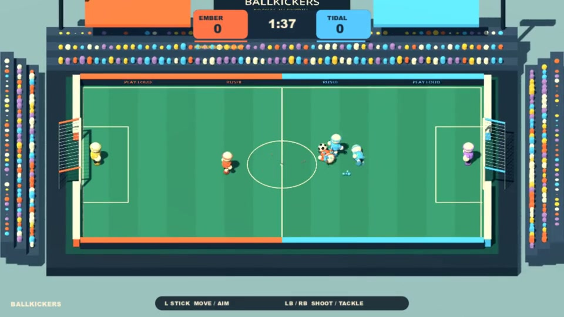

# Ballkickers

[Download for Windows](https://github.com/joepio/ballkickers/releases/latest)
 · [Gameplay preview](https://github.com/joepio/ballkickers/raw/main/assets/preview.mp4)



A playful, fast party football prototype for Godot 4.5.2. Original procedural
stadium, marshmallow athletes, recorded football Foley, original arcade accents and arcade ball physics.

## Play

Open `build/Ballkickers.exe`. It is a standalone Windows build; no Godot install is
needed. Keep `Ballkickers.pck` beside it. Alternatively open `project.godot` in Godot.

The default **1v1 Dual** experiment gives each person two outfield players.
Select **2v2 or 3v3** in Matchup for one unit per controller, plus an automatic
keeper on each team. Three humans in 2v2 or five in 3v3 get one bot in the empty
place. Controller seats alternate orange/blue teams and retain ownership.
1v1 and 2v2 share the original pitch size. 3v3 has three times the pitch area,
with unchanged unit and goal sizes. `-- --teams=2` or `-- --teams=3` selects them on launch.
The menu defaults to **1v1** (two controllers). At every kickoff and rematch,
each team's L unit starts screen-left of its R unit; stick ownership stays fixed
while you play, even if the units cross each other.

| Half | Move and aim | Shoot / tackle | Keyboard fallback |
|---|---|---|---|
| Left player (L) | Left stick | LB | WASD + Q |
| Right player (R) | Right stick | RB | Arrows + Ctrl |

Hold a shoulder button with the ball to charge, release to shoot. Without the
ball, press it to dash/tackle. Contact with a loose ball during the dash kicks
it immediately. Team-colored ground triangles show aim and extend only as shots
charge. A half-filled circle above each unit identifies the controlling stick:
left half for the left stick, right half for the right. There is no hidden
goal-aim assist in Dual mode.
In 2v2/3v3, use the **left stick** to move/aim and **either LB or RB** to shoot or
tackle (keyboard: WASD + Q). Markers have transparent backgrounds, a team-colored
outline and distinct white/gold/lilac centers for teammates. No P1/P2 labels.
Passing, sprinting and automatic switching are disabled for this experiment.
The two units keep their left/right assignments throughout the match.

Start / Escape pauses. Y / Tab returns to the menu while paused. F11 toggles
fullscreen. **Controls → Classic** retains the earlier experiment and AI code:
1–4 people, X / J shoots with the ball or tackles without, A / K passes,
RT / Shift sprints, LB / Space switches, and control follows a bot receiving
possession. A second keyboard uses arrows, numpad 1/2, Ctrl and numpad 0.

Menu: stick or D-pad up/down selects a row, left/right changes it; A or Start
starts. Clicks also work. F3 shows performance. F12 saves a screenshot to the
source `captures` folder when running from source.

Receiving the ball gives close dribbling control; quick shots keep play moving.
There are no fouls or throw-ins. Rebound walls keep the ball live. Sprint and
tackles spend stamina. Passing, tackling and time fill a team power meter;
holding a shot for at least 0.85 seconds with a full meter releases a powerful
shot that knocks opponents aside. Matches last 1–5 minutes; ties enter golden
goal. Start/Enter instantly rematches after the result.

Keepers track the ball and commit to diving saves. Save probability decreases
with ball speed and contact near the edge of their reach, using seeded randomness.
Hard shots can break through or produce rebounds and push the keeper backward
into the goal. Catches are distributed to an open teammate after half a second.
Keepers wear yellow/purple kits and oversized gloves; player switching stays
with the outfield players. In Classic 1v1, when a bot teammate receives possession, control
automatically follows the ball, preferring the human who passed. Another human's
athlete is never taken over. LB / Space still switches manually off the ball.

## Characters and crowd

Every athlete has a signature look (mohawk, afro, ponytail, backwards cap,
spikes, moustache, top bun or round glasses), a face that blinks, frowns while
charging or dashing, grins on the ball and sees stars when tackled, and a
signature goal celebration: jump, spin, aeroplane or backflip. The team that
concedes hangs its head.

The 520 supporters, on three sides and a low near stand, are built like small athletes, with shirts in their team's
colours, skin tones, hats and hair. One GPU shader animates them: idle fidgeting,
jumping and waving for their own team's goals, slumping after a goal against,
rising for shots, saves and chaos, and a Mexican wave when play is calm in
midfield. A few superfans hold signs ("HI MUM!") or wave big flags.

## Stadium and screen

The stadium screen behind the back stand is the scoreboard: score, clock and
both power meters (gold when a power shot is ready). The on-screen HUD keeps
only player markers, a fading controls reminder at kick-off and the big moments.
Around the bowl are dugouts, corner floodlight towers that each cast their own
shadow, two camera operators walking the far touchline to keep the ball in frame,
food trucks with queues, car parks, the team buses, flags, a park with trees,
hills, a small skyline, clouds and a slow Ballkickers blimp. The main camera is a perspective broadcast camera high on the near
stand: it pans and turns slightly with the ball, leans in a touch near a goal and
after one, and always keeps the whole pitch in shot.

## Goal replays

After the celebration every goal gets a TV-style action replay: a team-stripe
wipe, a REPLAY bug, a low broadcast camera that follows the build-up in real
time, a cut to the camera behind the net for the finish in super slo-mo, a
chalked telestrator line of the ball's path, a lower third with the scorer, a
commentary cliché that fits what happened (own goal, power shot, rebound, keeper
error, long range, the beach ball) and a speed-gun reading, then a hold on the
net. Then come a few cutaways, mixed differently each time: the scorer jumping
straight into the lens, the winning coach going wild on the touchline, the other
coach with hands on head, and the scoring team's stand. The two coaches (suit,
team tie and cap, one moustache, one pair of glasses) pace the touchline during
play and point at the ball when it comes near. A, Start or a shoulder button (Enter,
Space, Esc, Q or Ctrl on keyboard) skips it. The GameNight `replays` setting
turns them off. Replays only re-render recorded snapshots; the match state is
restored exactly afterwards (`tests/replay.gd`).

## Football chaos

Every so often the match is interrupted by something that has nothing to do with
football. One event runs at a time, announced on screen, and each ends by itself
within about 15 seconds:

- **Streaker**: an invader weaves across the pitch, shoving players and
  backheeling a loose ball, with a hi-vis steward a step behind.
- **Fireworks**: flares are thrown from the stands. A flashing ring marks each
  blast radius; anyone inside when it goes off is knocked down and the ball is blown away.
- **Pitch protest**: a line of protesters marches across with a banner that
  blocks players and bounces the ball.
- **Second ball**: a beach ball lands from the crowd. Run or dash into it; it
  counts as a real goal until the stewards confiscate it.
- **Dog**: a dog chases the ball, steals it even from a dribbler and runs off
  with it. Dash into the dog to make it drop it.
- **Sprinklers**: the pitch gets wet; players slide and the ball barely slows.
- **Gale force wind**: gusts push the ball (more so in the air) and drift players.

Menu **Chaos** (or the GameNight `chaos` setting) selects Off, Some (default,
roughly one event every 40 seconds of play) or Lots. Events use their own seeded
random stream, so the match's AI and keeper rolls are unchanged.
`-- --demo --chaos=dog` forces an event at kickoff and
`tools/capture_chaos.gd` renders one mid-event.

## GameNight

`tools/register_gamenight.ps1` adds this local build without replacing other
local games. Restart GameNight to refresh the local shelf.
Both local and published registrations use one **Ballkickers** entry, which
automatically selects 1v1 for one/two humans,
2v2 for three/four, or 3v3 for five/six. The party can override this using the
Matchup setting; changes apply to the next match.
The registration script removes legacy mode-specific entries and uses the
latest build without forcing a team size. The game adapter supports six human seats; the current GameNight
lobby exposes only four. Consequently, 3v3 can currently launch there with bots
in the remaining places, but six humans require a host with six-seat support.
Windows XInput also limits conventional XInput controllers to four.

The game implements authenticated WebSocket lifecycle messages and authoritative
host controller frames. Opaque device tokens retain ownership; stale input is
neutral after 250 ms. Managed sessions skip the menu, prepare off-screen, freeze
and hide on host pause, resume the same state, and support repeated sessions.
Back/Select returns to GameNight. Standalone Start is an in-game pause menu.
Party profile names, colours, skin and pixel portraits appear in the HUD.
New players join at the next session (`instant_join: false`). Local multiplayer
only; no online netcode. A managed match automatically rematches after nine seconds.

## Develop

```powershell
./tools/build.ps1
./build/Ballkickers.exe -- --demo --stats
```

Simulation and input/lifecycle regression scripts run during the build.
`tools/generate_audio.py` rebuilds 18 sound effects from the included CC0 recordings
(requires Python, NumPy and ffmpeg). See `third_party/AUDIO-CREDITS.txt`.
The audio uses non-repeating variations, softer contact levels, duplicate
suppression and dedicated goal/whistle voices. `tests/audio.gd` checks playback.
`-- --demo --capture=E:/path/frame.png --capture-at=12 --exit-at=30` produces
repeatable visual captures and frame statistics. Tests use fixed seeds.

Static stadium and scenery geometry is combined by material; 520 spectators use
one MultiMesh per body part. The perspective camera backs off with the pitch size to keep the
whole pitch visible. No downloaded visual art, third-party character assets, or heavyweight postprocessing.
Football and whistle recordings by Joseph SARDIN / BigSoundBank and soft impacts
by Kenney are CC0; the goal melody and power accents are original.
Fonts: Lilita One and Fredoka, both SIL Open Font License (`third_party/FONTS-OFL.txt`).

Shots have 33 ms of hit-stop and successful impacts 50 ms, capped rather than stacked.

This is a first playable prototype, not a certified GameNight release.
Physical multi-controller testing and match balance still benefit from playtests.

## Releases

GitHub Actions builds and tests Windows on pushes and pull requests. Push a
`v*` tag to publish a tested portable ZIP, SHA-256 checksums and preview assets.
The download includes the official Godot runner and its license notices.
Only distributable files are packaged; captures, local registrations and backups
are excluded. The current release targets Windows x86-64.

The five-second preview is captured with `tools/capture_preview.gd`: three staged
setups using the real game simulation, AI, shot and tackle mechanics. It is
bot-driven gameplay, not footage of a human match. See the harness for seeds.

## Assistant controls

See [GameNight settings](docs/gamenight-settings.md) for all supported tweaks, their ranges and when they apply. The phone and lobby assistant discover these controls automatically from the running game.
